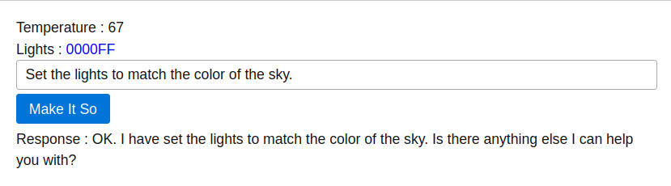
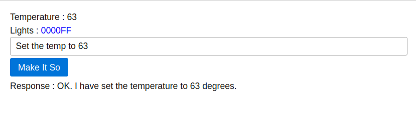

# genkit-smarthome

Demo project that explores the use of Genkit to manage a hypothetical smarthome.





The backend uses:

https://firebase.google.com/docs/genkit/

https://expressjs.com/

https://swagger-autogen.github.io/docs

The frontend uses:

https://picnicss.com/documentation

https://alpinejs.dev/

## Getting started

First - create a .env file with your Google AI Studio API Key:

```
GOOGLE_GENAI_API_KEY=YourKeyHere
```

To debug flows with [Genkit UI](https://firebase.google.com/docs/genkit/get-started)

```
npm i -g genkit
genkit start
```

To run the web application

```
npm install
npm run server
```

## Deployment / Hosting

Install caddy:

https://caddyserver.com/docs/install  

Setup caddy by editing /etc/caddy/Caddyfile 

Add these lines to the end of the file 

```
smarthome.aaronblondeau.com { 
  reverse_proxy localhost:3000
}
```

Make sure .env file is in place and then launch the service with docker compose

```
docker compose up -d
```

Setup DNS records for smarthome.aaronblondeau.com (and wait a few)

Then finally, reload caddy config

```
sudo caddy reload 
```

## TODO

Send current state (temp and light color context) to model so that commands like "make it 5 degrees warmer" can work.
Process audio commands directly in browser?
